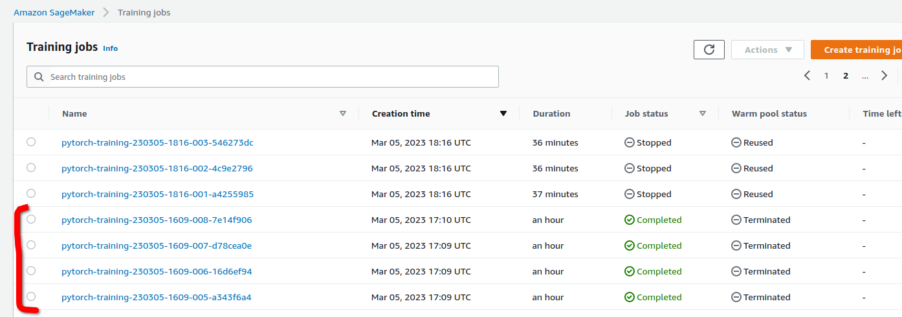
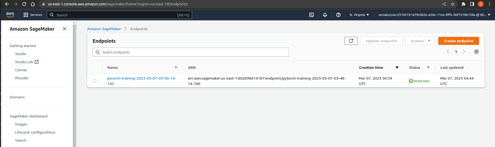

## Introduction

The project is is basically classification of images using AWS Sagemaker. For this project, we are using the dog breeds dataset provided by Udacity hosted at AWS S3, which consists of images about 133 breeds of dogs. We will be using this datset, to showcase our skill on image classification using AWS.

## Dataset Preparation

First the zip file os the dataset has been downloaded from the hosting bucket "https://s3-us-west-1.amazonaws.com/udacity-aind/dog-project/dogImages.zip" to the current directory and been unzipped. This unzipped dataset has been then uploaded to our S3 bucket. Then the storage location has been stored.

## Hyperparameter Tuning

To find the optimal hyperparameters we set to vary the learning rate from 0.01 to 0.1 and batch size between 64, 128 and 256. We then ran a tuner job which will run the training jobs with all these configurations and provide us the optimal configuration to train the model. This has took more than an hour. The python script for hyper parameter training job has been provided separate in a file called hpo.py

## Model Profiling and Debugging

Next we set up the rules for creating the profiler-report on our project and debugging based on logs, we created. Next we collect the hyperparameters from the best tuner job. Withb alll these configurations set, we will be training an estimator. I have only trained the model for a single epoch because of the cost considerations of the AWS. So, this gave a very low accuracy. After the training has been completed, we collect the trials for the tensors created during training, and plot a debugging time series CPU utilization plot. Next we will build the profiler-report from the profiler-data received. Then, store this report inside the S3 bucket. Then we will display this report in the the notebook itself.

## Model deploying

In this step, we will be deploying this model trained to an endpoint inside sagemaker. Deployment took around 5 minutes. After this, we will preparaing an image for prediction using this endpoint. We serialize the test image and use this serialized image for prediction.

## Predictng the test image

Next we will use the enpoint created in the previous step and predict the serialized image. This would return a list of 133 datapoints, we would take the index of the maximum datapoint and print that as output. But, in our project the prediction is wrong. This is because, we have trained the model for only a single epoch, because of resource constraints which produced an accuracy of about 14% which is critically low.
