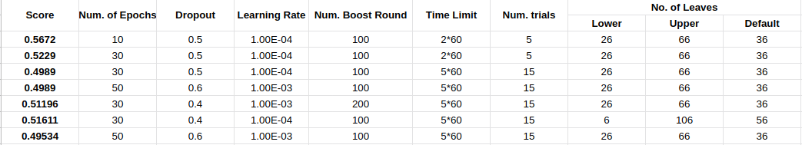
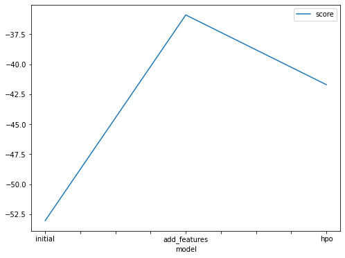
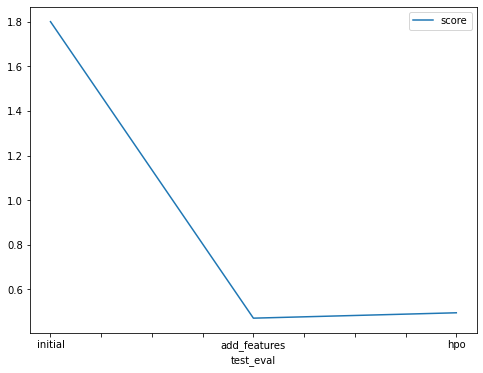

# Report: Predict Bike Sharing Demand with AutoGluon Solution
#### Santhosh G S

## Initial Training
### What did you realize when you tried to submit your predictions? What changes were needed to the output of the predictor to submit your results?
When I tried to submit the predictions, for some of the models at certain points negative count values were generated. In real world scenario, count values cannot be negative. So, Kaggle will not be accepting prediction values lesser than zero. So, we need to bound all the negative values to zero to submit the results.

### What was the top ranked model that performed?
WeightedEnsemble is the top ranked model in the initial and add_features step, but when we tuned the parameters, another model LightGBM_BAG had equal scores with WeightedEnsemble, but LightGBM_BAG outperformed slightly at pred_time_val and fit_time.

## Exploratory data analysis and feature creation
### What did the exploratory analysis find and how did you add additional features?
In the EDA step, I found that having the datetime column as such doesn't add any value to better fitting, but when we splitted it into year, month, date and hour, the model was able to perform significantly better. Also, changing the dtype to category, also have added value to the prediction. 

### How much better did your model preform after adding additional features and why do you think that is?
The same model was able to perform more than 4 times the original prediction after adding features and declaring some categorical variables to "category". This is because the time variables such as year, month, day and hour influenced the count label to a good extent. Also when we changed the dtype of season and weather column to "category", this allowed the library to interpret the feature better and thereby producing better results.

## Hyper parameter tuning
### How much better did your model preform after trying different hyper parameters?
I tried various combinations for hyper-parameters and logged the results, but I couldn't able to make the model perform better than the add_features one. I will attach the table containing various tuning points which I have tried. I possible could you please provide me some hints on where to nudge to achieve a good score.

### Image containing various parameters which I have tried and their appropriate scores.

### If you were given more time with this dataset, where do you think you would spend more time?
If given more time, I would spend more time on Exploratory Data Analysis, and find out the relationship between various columns. This would give me a deep understanding on the dataset which I am working on and provide insights on overall dependency of the dataset. Also hyper-parameter tuning is the place where I need to spend lot of effort, by trialing various parameters to improve the score.

### Create a table with the models you ran, the hyperparameters modified, and the kaggle score.
|model|hpo1|hpo2|hpo3|score|
|--|--|--|--|--|
|initial|default|default|default|1.7998|
|add_features|default|default|default|0.4712|
|hpo|EPOCHS:30|TIME_LIMIT:5*60|NUM_TRIALS:15|0.4953|

### Create a line plot showing the top model score for the three (or more) training runs during the project.

### Create a line plot showing the top kaggle score for the three (or more) prediction submissions during the project.

## Summary
The overall inference for me in this project is that, I have understood the importance of Exploratory Data Analysis. This is the step which have boosted the score significantly. Hyper-parameter tuning didn't work for me. I think, if I had more time I would spend more time on this part. This project gave me great learning opportunity, and it was really fun working on the real world datasets.
